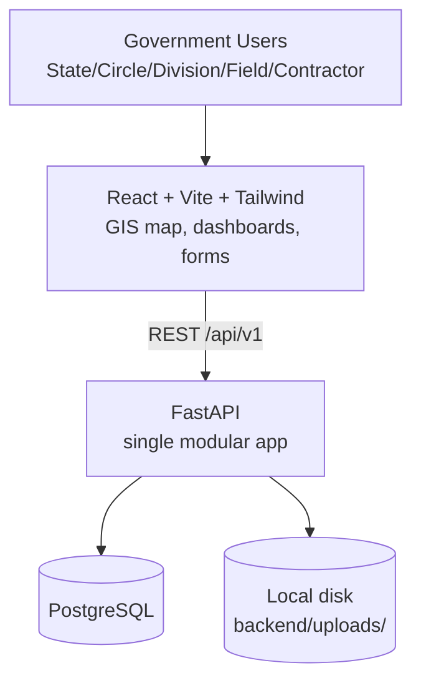
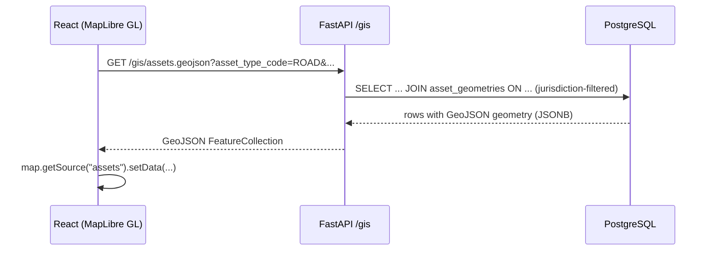
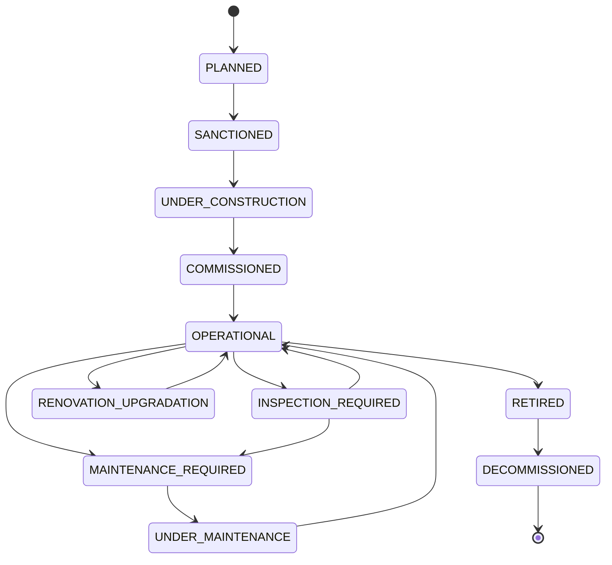

# Architecture

## Overview

A modular monolith, deliberately simplified for a hackathon MVP: one FastAPI backend, one React
frontend, one PostgreSQL database, local disk for file storage. No microservices, no
message broker, no reverse proxy.

## Why a modular monolith

The spec's full production architecture (Nginx, Redis, Celery workers, MinIO, Docker Compose) was
simplified away for the hackathon: it added operational overhead without adding demo value. Every
piece removed has a stated migration path back in if the project continues past the hackathon:

- **Background jobs (Celery/Redis) → synchronous computation.** "Due" status (inspections due,
  work orders overdue) is computed at request time in `app/routers/reports.py` instead of via a
  scheduled worker. Fine at demo scale; would move to a scheduler once data volume justifies it.
- **Object storage (S3/MinIO) → local disk.** `app/utils/storage.py` is the only place that touches
  the filesystem. Swapping it for an S3 client later doesn't touch any router or model.
- **Nginx reverse proxy → direct connections.** The frontend calls the backend's origin directly
  (CORS configured in `app/main.py`); a proxy can be reintroduced at deploy time without app changes.

## Backend modules (`backend/app/`)

| Module | Responsibility |
|---|---|
| `auth/` | Password hashing, JWT access/refresh tokens, `get_current_user` / `require_roles` dependencies |
| `permissions/` | RBAC role table + jurisdiction (administrative-unit subtree) scoping, enforced server-side |
| `models/` | SQLAlchemy ORM models (one file per domain) |
| `schemas/` | Pydantic request/response models |
| `routers/` | One router per resource group, mounted under `/api/v1` |
| `services/` | Business logic that doesn't belong in a router: lifecycle state machine, condition
  scoring, asset CRUD orchestration, notifications |
| `gis/` | GeoJSON validation and geometry-kind helpers |
| `utils/` | Local file storage abstraction, audit log writer |

Authorization is enforced in every router via FastAPI dependencies (`require_roles(...)`), never
only in the frontend. Jurisdiction scoping (`app/permissions/jurisdiction.py`) restricts list
queries to a user's administrative-unit subtree using a materialized path column, so it's a single
indexed `LIKE`/`IN` filter rather than a recursive query per request.

## Frontend structure (`frontend/src/`)

Pages call typed functions in `api/` (axios + React Query), never touch `fetch` directly. Auth
state lives in `hooks/useAuth.tsx` (JWT in localStorage, silent refresh on 401). The GIS map
(`pages/GisMap.tsx`) and per-asset mini-map (`components/AssetMiniMap.tsx`) both render
MapLibre GL against the backend's GeoJSON endpoints (`/gis/assets.geojson`, `/gis/nearby.geojson`).

## GIS flow

Geometry is stored once per asset in `asset_geometries.geom` (GeoJSON in a JSONB column) so a single
table serves points (bridges/culverts/structures), lines (roads) and polygons (buildings) without
per-type geometry columns. Nearby searches use a local meter-based projection in Python/Shapely.

## Lifecycle state machine

Enforced in `app/services/lifecycle_service.py` (`ALLOWED_TRANSITIONS`), never in the frontend.
Every transition writes an append-only `lifecycle_events` row (asset, old status, new status, actor,
reason, timestamp) — history is never overwritten.

## Condition & risk scoring

Deterministic and explainable by design (no black-box model): `app/services/condition_service.py`
combines five weighted factors (asset age vs. useful life, latest inspection condition, worst
finding severity, open-maintenance-request count, proximity to end-of-life) into a 0–100 score and
a GOOD/FAIR/POOR/CRITICAL rating. Every `ConditionAssessment` row persists both the factor inputs
and the weights used, so any score can be reconstructed and audited later.

## Key design decisions

- **Common `assets` table + type-specific detail tables** (`roads`, `bridges`, `culverts`,
  `buildings`, `structures`) instead of one wide table — keeps the core registry generic while
  each asset type's attributes stay strongly typed.
- **Approvals as first-class records** (`approvals` table) alongside the specific status fields on
  `inspections`/`maintenance_requests`, so there's one place to query "what's pending my decision."
- **Audit log is separate from application logs** (`audit_logs` table, written via
  `app/utils/audit.py` inside the same transaction as the business change) — required for
  government accountability, not derivable from server logs.

## Deployment

Out of scope for the hackathon build, but the app is deliberately cloud-neutral: FastAPI +
PostgreSQL run anywhere (a VM, a container platform, a managed Postgres service). No
AWS-specific SDKs are used; `app/utils/storage.py` is the only integration point for adding S3 later.
