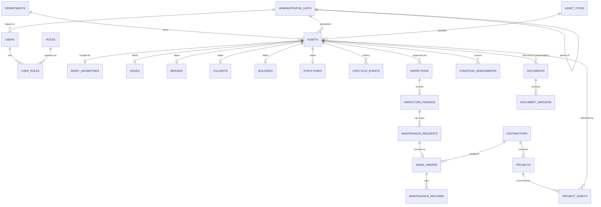

# Database

PostgreSQL. Geometry is stored as GeoJSON in `JSONB`, so PostGIS is not required. Schema is managed
by Alembic (`backend/migrations/`); the full initial schema is
`backend/migrations/versions/0001_initial_schema.py`. All primary keys are UUIDs; all tables carry
`created_at`/`updated_at`; foreign keys and indexes are defined in the migration.

## Entity-relationship overview



`documents.linked_entity_type` + `linked_entity_id` is a polymorphic reference (asset, inspection,
work_order, project, …) rather than a separate join table per entity type — kept the document
module generic without a table explosion.

## Tables

| Table | Purpose |
|---|---|
| `departments`, `administrative_units` | Government org structure; `administrative_units` self-references with a materialized `path` column for fast jurisdiction-subtree filtering |
| `roles`, `permissions`, `role_permissions`, `user_roles` | RBAC; `user_roles.jurisdiction_unit_id` optionally scopes a role grant to one administrative unit |
| `users` | Accounts; `department_id` + `administrative_unit_id` set a user's home context |
| `asset_categories`, `asset_types` | Reference data for the 6 seeded asset types |
| `assets` | Common asset entity (identity, ownership, jurisdiction, lifecycle status, condition, financials) |
| `asset_geometries` | One row per asset; GeoJSON geometry stored in a `JSONB` column |
| `roads`, `bridges`, `culverts`, `buildings`, `structures` | Type-specific attributes, 1:1 with `assets` |
| `asset_relationships` | Generic asset-to-asset linkage (e.g. a culvert along a road) |
| `lifecycle_events` | Append-only lifecycle transition history |
| `inspection_templates`, `inspection_items` | Per-asset-type checklist definitions |
| `inspections`, `inspection_findings` | Field inspection records, GPS point, findings with severity |
| `condition_assessments` | Deterministic condition/risk score with persisted inputs + weights |
| `maintenance_requests`, `work_orders`, `maintenance_records` | Maintenance workflow through to verified closure |
| `contractors`, `contractor_assignments` | Contractor registry and their project/work-order assignments |
| `projects`, `project_assets` | Projects and the assets they commission |
| `documents`, `document_versions` | File metadata (local disk storage_key) with versioning |
| `approvals` | Generic approval record for inspections, maintenance requests, lifecycle transitions, projects |
| `notifications` | In-app notifications, generated synchronously during the triggering API call |
| `audit_logs` | Immutable business audit trail, separate from application logs |

## Migrations

```bash
cd backend
alembic upgrade head          # apply
alembic revision --autogenerate -m "..."   # generate a new migration after model changes
```
